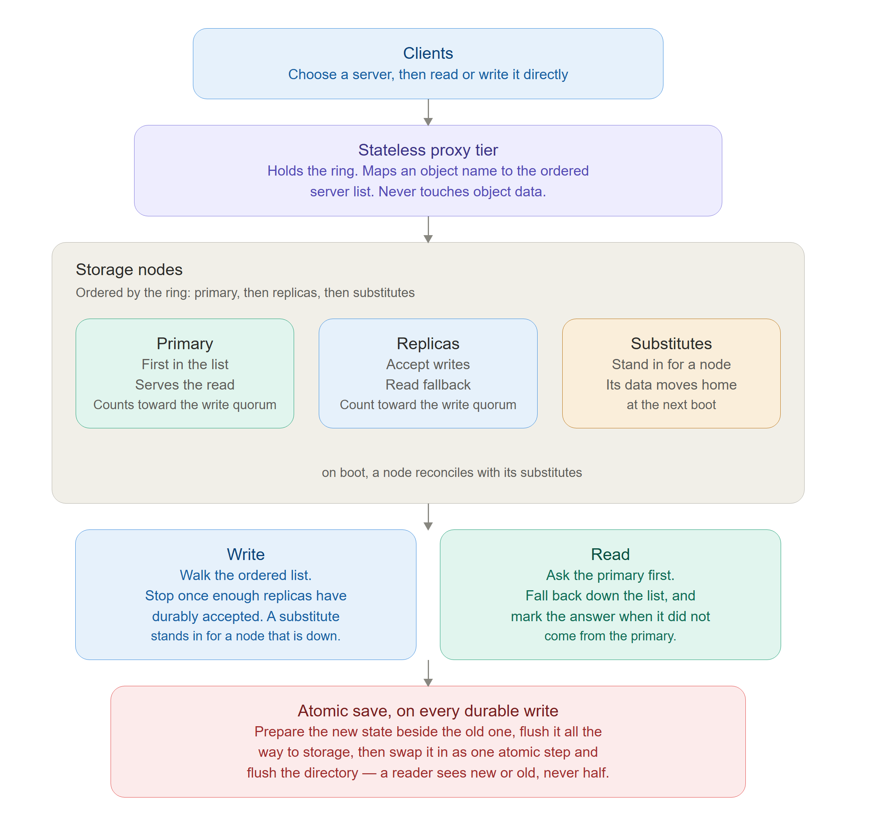

# Design Document

*Due in the `demo-2` branch, updated for `demo-3` and `final-demo`.
**The TA will run this document.** If they cannot follow it, you lose the points.*

## 1. Architecture

`swift_light` is a three-tier object store laid out the way upstream Swift is: a client, a proxy
tier, and a set of storage nodes, with no metadata master anywhere in the path. Placement comes
from a consistent-hashing ring that every proxy holds a copy of, so any proxy can answer "where
does this object live?". The ring is stored on disk, which makes it survives a crash.
For each object the ring yields an ordered list of servers that may
hold it: the primary first, then the remaining replicas, then a set of substitutes further down
the list.  
A client asks the proxy for that list, then talks to the storage nodes directly.
A write goes down the list until enough replicas have durably
accepted the object, so a write still succeeds while a replica is down, because a substitute
takes its place; the write is only reported as failed if too few replicas acknowledge. A read
goes to the primary first and falls back down the list if the primary is unreachable or does not
have the object. Storage nodes are stateless
HTTP front ends over a plain on-disk store, so a restart loses nothing. When a node is
unreachable, a substitute holds the object on its behalf until the owner returns, and on boot
each node reconciles in both directions — collecting what others are holding for it and handing
back what it is holding for them — so a node that was down rejoins without losing or orphaning
data.  
Health is checked by the proxy, which probes the nodes it knows and treats a node as
failed once it has been quiet for a while; a dead node never takes the proxy down with it.
What makes this system more than a re-implementation is that the same atomic-save rule applys on every durable write,
from the smallest piece of node state up to the ring itself. The
rule is always the same: never modify a file in place — build the new version beside the old
one, flush it all the way to storage, then swap it in as a single atomic step and flush the
directory, so a reader or a reboot sees either the complete old version or the complete new one
and never a half-written one.



## 2. Design decisions

The choices that mattered, the alternatives, and why you chose as you did.
Include the things that did not work.

## 3. Setup

Exact dependencies, versions, and hardware assumptions. Written so that someone
starting from a clean machine can follow it.

```bash
# every command needed to go from a fresh machine to a runnable system
```

## 4. Running the experiments

One entry per claim you make. Someone else runs these; you do not get to
explain them in person.

### Experiment 1: <the claim this supports>

| | |
| --- | --- |
| Supports | <which figure, table, or statement in your slides> |
| Command | `experiments/<script>.sh` |
| Expected runtime | <minutes> |
| Expected output | <what they should see, and what counts as a match> |

### Experiment 2: <...>

## 5. Claims and limitations

What your artifact supports, and an honest account of what does not work or was
not tested. *An honest narrower result scores better than an impressive result we
cannot reproduce.*
