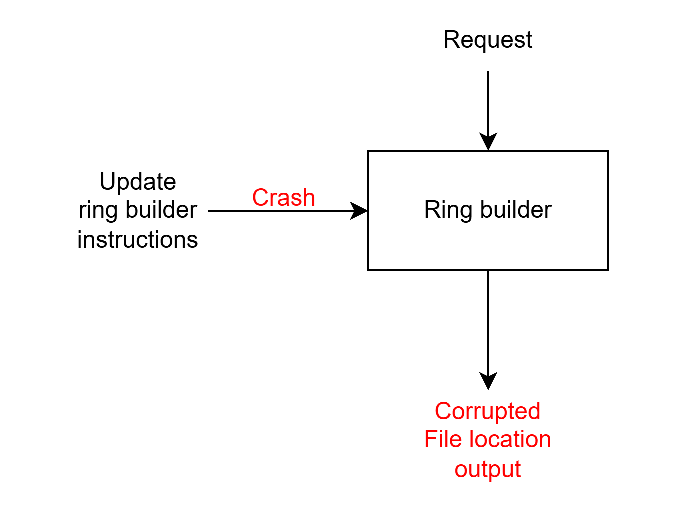
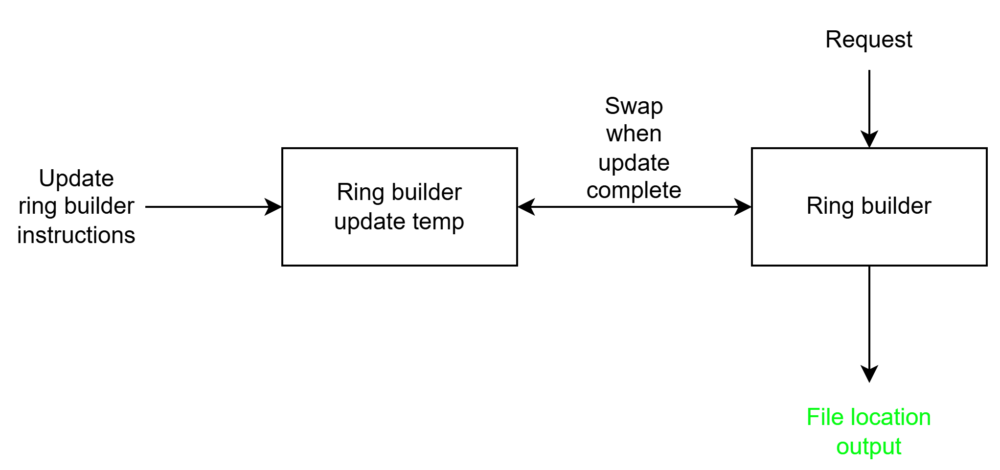

# Design Proposal

*Due in the `demo-1` branch at 12:00 noon on 09/23. This document is what your
progress is graded against for the rest of the semester — see the
[progress rubric](https://ec528.github.io/ec528/fall26/grading/#progress).*

## 1. Problem

For every file, their placement in a Swift cluster makes comes from a single
**ring builder file**, which are generated from the builder, but the relationship is
one-way: the builder is the artifact an operator edits, rebalances and keeps,
and the generated rings are output. In practice the builder file is the
cluster's source of truth about its own layout.

The problem is that Swift rewrites this source of truth **in place**. When an
operator changes a device or rebalances, the tool serializes the entire builder
back over the existing file, replacing it while it writes. If the process dies
partway through, the file is left half-written and can no longer be read back.
The same is true even with no crash at all: anything that reads the builder
while it is being written will read the half-way modified file.

The reporter's own follow-up on this entry notes that the same pattern appears
in more than one place. **Composite ring builder file**, which records how
several individual rings are joined into one larger ring. It is written in
exactly the same way — serialized over the existing file, in place — and read
the same way, so a crash during a composite ring update leaves it unreadable as well.

## 2. Proposed design

We will change how the ring builder file is written so that the cluster's source
of truth is never left partially written. The new version of the builder is
prepared as a separate **ring builder temp** file alongside the existing one, 
its contents are flushed all the way to storage after a successful write.
A reader, or the next invocation of the tool after
a crash, therefore sees either the complete previous builder or the complete new
one, and never something in between.

For the directory follow up, we will use the same approach for composite ring builder files. The
existing composite ring builder file is never modified in place, and a new
composite ring builder temp file is written and flushed to storage before it is swapped in.

### Before and after

**Before.** The builder is serialized directly over the existing file, so a crash
partway through — or any reader running at the same time — can observe a
half-written builder:

**After.** The new builder is written to a separate temp file and flushed to
storage, then swapped in, so a reader sees either the complete previous builder
or the complete new one:

## 3. What makes this hard

At first the fix sounds easy: write the new builder to a temp file and rename
it over the old one. As we studied it, we found the hard part is making sure the
replacement is safe no matter when the process dies. The builder file is the cluster's source of truth, so a mistake here corrupts the cluster's layout and not only one file.

Writing a temp file and renaming it is only safe if a few steps happen in the
right order:

1. **Write the full new builder to the temp file.** If the tool crashes here,
   the old builder has not been touched, and the half-written temp file is
   simply ignored.
2. **Flush the temp file to storage.** Without this, the operating
   system may still be holding the data in memory. After a power loss the
   rename could survive while the contents do not, leaving an empty or
   partial file under the real builder name. That is the same bug we are
   trying to fix.
3. **Rename the temp file over the old builder.** On Linux, a rename within one
   filesystem is atomic, so a reader sees the old file or the new file and
   never a mix. This only holds if the temp file is in the *same directory*
   as the builder. A temp file may be on a different filesystem,
   where the rename becomes a copy and is no longer atomic.
4. **Flush the directory as well.** The rename is itself a change to the
   directory, and it can be lost in a crash if the directory is not flushed.

If any step is skipped or done out of order, we get a new way to fail instead of
fixing the old one. That is why this is hard: there is a possible crash between
every pair of steps, and for each one we have to be able to say what the next
reader or tool run will see.

There are also some side problems around the same fix that we still need to
understand:

- **Leftover temp files.** A crash can leave a stale temp file behind. The tool
  must not mistake it for a valid builder, and must not fail because one
  already exists.
- **Two runs at once.** If two calls use the same temp file name they can
  overwrite each other's work, so the name or a lock has to prevent that.

This is not solved by wiring existing services together, because there is no
library call that makes a Swift builder update crash-safe. We have to read
Swift's own code to find every place the builder and composite builder are
written in place, and change them without breaking the rest of the tool. We
also have to prove the result. The crash window is tiny, so we cannot just
hope to hit it by chance. 

## 4. How you will know it worked

The measurements that will show your system does what you claim: what you will
measure, against what baseline, and what result would count as success.

## 5. Milestones

**Milestones must be verifiable.** A milestone is verifiable if a reader can tell,
without asking you, whether it is done. "Improve performance" is not verifiable;
"end-to-end write latency under 50 ms at 1k req/s, measured by
`experiments/latency.sh`" is.

| Demo | Date | Milestone | How we will demonstrate it |
| --- | --- | --- | --- |
| Demo 2 | 10/21 | Bug reproduction | On a local Swift environment, kill the ring builder mid-update, then run a ring position lookup; it fails with `does not contain valid composite ring data`.|
| Demo 2 | 10/21 | Bug fix | Run the same kill-mid-update against the patched builder; the composite ring builder is byte-identical to its pre-crash contents and ring position lookups still succeed. |
| Demo 3 | 11/16 | Deployment | The Launchpad bug report for the composite ring builder is marked Fix Released with no unanswered questions or remaining issues. If swift official's review on the patch is delayed, community's confirmation of fixing of the bug can be used as demostration. |
| Demo 3 | 11/16 | Comparison poster | Completion of `slides/poster.pdf` comparing swift's consistant hashing ring and RDBMS's(postgreSQL's) share nothing technology on scalability and fault tolerance. |
| Final | 12/09 | Project summary | Final demo delivered with the recorded video presentation, completed `docs/design-document.md` and `slides/final_demo.pptx` |

*You may revise these later — real projects change direction. Announce the change
and its justification at the demo and you are graded against the revised plan.
Silently dropping a milestone counts as a miss.*

## 6. Risks

1. If we going to implement the atomic saving, it might be more complicated than just simply writing the builder data into a temporary file and rename it. This failre could probably occur at any point during the serialization, flushing, synchronization or file replacement. If these operations are not handled correctly, the builder file may still become inconsistent after a crash. To address this risk, we will follow existing file-writing patterns in Swift where possible and ensure that the temporary file is fully written and synchronized before replacing the original builder file. We will also simulate failures at different stages of the save process and verify that the last valid builder file remains readable.
2. A failed save operation may leave incomplete temporary files behind. For example, if serialization fails after a temporary file has already been created, the original builder may remain safe, but an incomplete temporary file could remain on disk. Repeated failures could therefore create unnecessary files or interfere with later save operations. To mitigate this risk, the implementation will clean up temporary files when a save fails while preserving the original builder file. We will test these failure cases explicitly to verify that unsuccessful saves do not leave invalid persistent state.
3. Changing RingBuilder.save() could introduce regressions into existing Swift functionality. The current implementation is already used by Swift's ring-management tools, so the atomic-save modification must improve failure safety without changing normal RingBuilder behavior or making existing builder files incompatible. To reduce this risk, we will preserve the existing RingBuilder.save() interface and serialization format. We will run both the existing Swift unit tests and new tests for atomic-save behavior, comparing the results against the unmodified Swift baseline to verify that the new implementation provides stronger failure safety without breaking existing functionality.